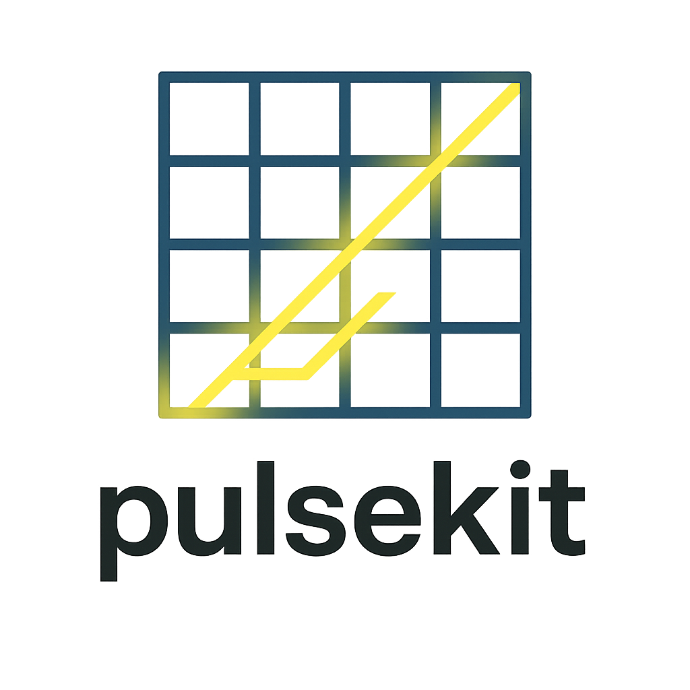

<p align="center">
  
</p>

<h1 align="center">pulsekit</h1>
<p align="center">
  <em>Solve deterministic and stochastic shortest paths using the Pulse algorithm.</em>
</p>

<p align="center">
  <!-- Update badges once the repo is public / CI is set up -->
  
  
  
</p>

---

## Why Pulse?

Classical shortest path algorithms struggle with **multiple constraints** or **stochastic arc costs**.  
The Pulse algorithm tackles these challenges by combining:

* **Depth-first search** over a **label-pruned space**  
* **Dominance rules** and **bounds** to discard infeasible paths early  
* Flexibility to support **multi-objective**, **resource-constrained**, and **stochastic** variants

With **pulsekit** you can:

* Solve deterministic and stochastic shortest path problems.
* Handle time windows, risk constraints, and multi-resource bounds.
* Extend and adapt the pulse strategy for your own use cases.

---

## Installation

```bash
pip install pulsekit            # from PyPI (coming soon)
# or, for development:
git clone https://github.com/your-username/pulsekit
cd pulsekit
pip install -e .
